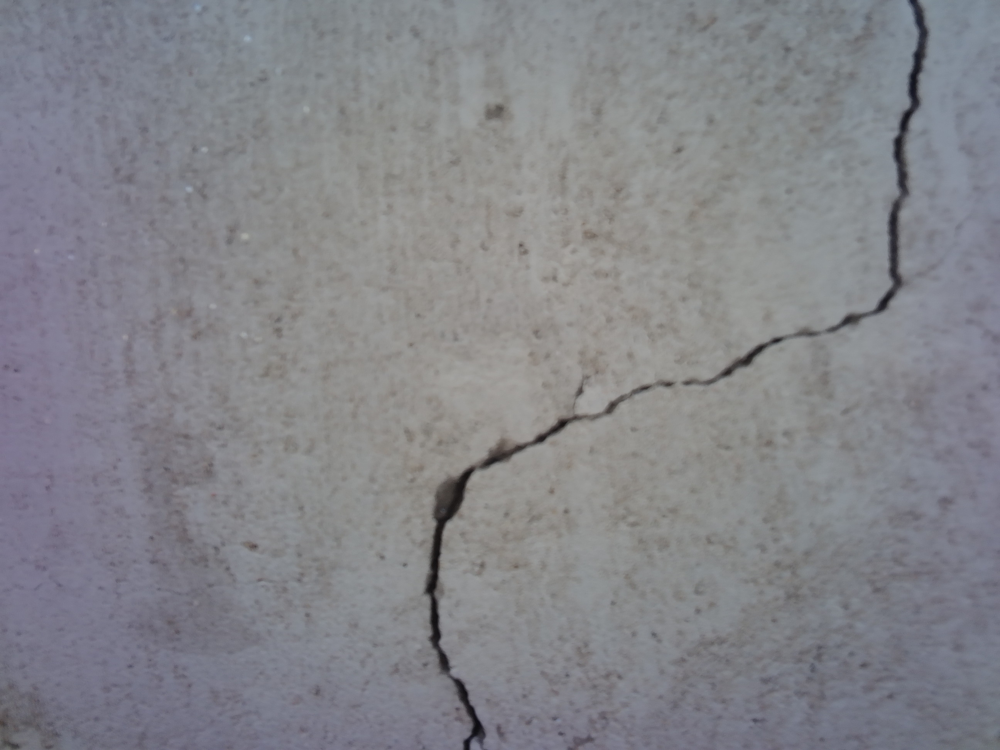
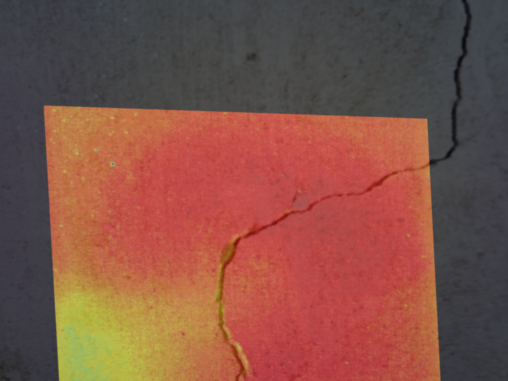

# Tunnel Crack Detection Thermal And Visible Dataset (CrackTAV)
A multimodal dataset for tunnel crack detection, containing various channel configurations including RGB, IR, fused RGB-IR, RGB-T, and RGB-IR modalities.


**A multimodal dataset for tunnel crack detection, containing various channel configurations including RGB, IR, fused RGB-IR, RGB-T, and RGB-IR modalities.**

## Overview

The Tunnel Crack Detection Dataset (CrackTAV) is a comprehensive dataset developed to support research in tunnel crack detection using multimodal imagery. The dataset includes visible light (RGB), infrared (IR), RGB_IR_Fused, RGBT, and RGBIR images, enabling researchers to explore the performance of detection models across different channel configurations and modalities. The dataset is designed to address challenges in complex lighting conditions and varying environmental factors.

## Table of Contents
- [Overview](#overview)
- [Dataset Structure](#dataset-structure)
- [Data Format](#data-format)
- [Sample Images](#sample-images)
- [How to Use](#how-to-use)
- [Citation](#citation)
- [License](#license)

## Dataset Structure

The dataset is organized into the following structure:

```plaintext
CrackTAV/
├── README.md               # Dataset description
├── images/                 # Contains all images in the dataset
│   ├── RGB/                # 3-channel RGB images (visible light)
│   ├── IR/                 # 3-channel IR images (thermal)
│   ├── RGB_IR_Fused/       # 3-channel fused RGB and IR images
│   ├── RGBT/               # 4-channel RGB and temperature images
│   └── RGBIR/              # 6-channel RGB and IR images
├── labels/                 # Ground truth labels for cracks
│   ├── RGB/                # Labels for RGB images
│   ├── IR/                 # Labels for IR images
│   ├── RGB_IR_Fused/       # Labels for fused RGB_IR images
│   ├── RGBT/               # Labels for RGBT images
│   └── RGBIR/              # Labels for RGBIR images
└── metadata.csv            # Metadata file containing additional information about each image
```

## Data Format

### Image Specifications

- **RGB Images**: 3-channel images representing the visible light spectrum.
- **IR Images**: 3-channel thermal images.
- **RGB_IR_Fused Images**: 3-channel images combining RGB and IR data.
- **RGBT Images**: 4-channel images, including RGB and a temperature channel.
- **RGBIR Images**: 6-channel images with both RGB and IR data combined.

- **Resolution**: All images are of size 256x256 pixels.
- **File Format**: Images are saved in JPEG format.

### Annotation Specifications

- **Format**: Annotations are provided as binary masks in PNG format.
- **Values**: Each pixel in the mask has a value of:
  - `0` for background (non-crack regions)
  - `1` for crack regions

## Sample Images

Below are sample images from the dataset, including RGB, IR, RGB_IR_Fused, RGBT, and RGBIR images along with their corresponding labels:

- **RGB Image Example**  
  

- **IR Image Example**  
  

- **RGB_IR_Fused Image Example**  
  

Each modality provides a different perspective for detecting cracks in tunnel surfaces, and combining these views allows for a more robust model training and evaluation.

## How to Use

### Loading Images and Labels

The following Python code demonstrates how to load images and corresponding labels based on their modality:

```python
import os
from PIL import Image
import numpy as np

def load_image_and_label(image_id, modality='RGB'):
    img_path = f'CrackTAV/images/{modality}/{image_id}.jpg'
    label_path = f'CrackTAV/labels/{modality}/{image_id}.png'

    image = Image.open(img_path)
    label = Image.open(label_path)
    return np.array(image), np.array(label)

# Example usage
image_id = 'img_001'
image, label = load_image_and_label(image_id, modality='RGB')
print("Image shape:", image.shape)
print("Label shape:", label.shape)
```

### Using the Dataset for Model Training

The following code demonstrates how to use the dataset for model training in PyTorch. It creates a custom `Dataset` class and a `DataLoader` for batch processing.

```python
import os
import torch
from torch.utils.data import Dataset, DataLoader
from torchvision import transforms
from PIL import Image
import numpy as np

# Function to load image and label
def load_image_and_label(image_id, modality='RGB'):
    img_path = f'CrackTAV/images/{modality}/{image_id}.jpg'
    label_path = f'CrackTAV/labels/{modality}/{image_id}.png'
    image = Image.open(img_path)
    label = Image.open(label_path)
    return np.array(image), np.array(label)

# Custom Dataset class
class CrackDataset(Dataset):
    def __init__(self, image_dir, label_dir, transform=None):
        self.image_dir = image_dir
        self.label_dir = label_dir
        self.transform = transform
        self.image_ids = os.listdir(image_dir)

    def __len__(self):
        return len(self.image_ids)

    def __getitem__(self, idx):
        image_id = self.image_ids[idx].split('.')[0]
        image, label = load_image_and_label(image_id, modality='RGB')
        if self.transform:
            image = self.transform(image)
            label = self.transform(label)
        return image, label

# Define transformations and create DataLoader
transform = transforms.Compose([
    transforms.ToTensor(),
])

dataset = CrackDataset('CrackTAV/images/RGB', 'CrackTAV/labels/RGB', transform=transform)
dataloader = DataLoader(dataset, batch_size=8, shuffle=True)

# Sample usage
for images, labels in dataloader:
    print("Batch of images:", images.size())
    print("Batch of labels:", labels.size())
    break
```

## Citation

If you use this dataset in your research, please cite it as follows:


